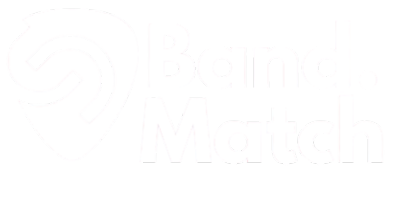

# 🎸 BandMatch

<p align="center">
  
</p>

<p align="center">
  Plataforma para conectar músicos, bandas e oportunidades musicais 🎶
</p>

---

# 📑 Sumário

- [📖 Sobre o Projeto](#-sobre-o-projeto)
- [🚀 Tecnologias Utilizadas](#-tecnologias-utilizadas)
- [✨ Funcionalidades](#-funcionalidades)
- [📂 Estrutura do Projeto](#-estrutura-do-projeto)
- [📸 Preview do Projeto](#-preview-do-projeto)
- [⚙️ Como Rodar o Projeto](#️-como-rodar-o-projeto)
- [🌐 Integração com CifraClub](#-integração-com-cifraclub)
- [🎯 Objetivo do Projeto](#-objetivo-do-projeto)
- [📄 Licença](#-licença)

---

# 📖 Sobre o Projeto

O **BandMatch** é uma plataforma desenvolvida para conectar músicos, bandas e artistas que desejam criar novos projetos musicais.

A proposta do sistema é facilitar a busca por integrantes através de filtros personalizados, permitindo encontrar pessoas com gostos musicais semelhantes, instrumentos compatíveis e experiências em comum.

Além disso, a plataforma permite que músicos compartilhem seus portfólios musicais e descubram bandas que estejam procurando novos integrantes.

---

# 🚀 Tecnologias Utilizadas

## 🎨 Front-end
- Next.js
- React.js
- JavaScript
- Bootstrap
- CSS Modules
- CSS puro

## ⚙️ Back-end
- Node.js
- Express.js

## 🗄️ Banco de Dados
- MySQL

## 🔐 Autenticação
- JWT (JSON Web Token)

## 🛠 Ferramentas
- Git
- GitHub
- REST API

---

# ✨ Funcionalidades

✅ Sistema de login e cadastro  
✅ Autenticação com JWT  
✅ Perfis personalizados para músicos  
✅ Sistema de filtros por:
- Idade
- Instrumento
- Gênero musical

✅ Exploração de músicos e bandas  
✅ Portfólio musical dos usuários  
✅ Sistema de bandas procurando integrantes  
✅ Interface responsiva  
✅ Upload de imagens  
✅ Integração com API do CifraClub  

---

# 📂 Estrutura do Projeto

```bash
📦 BandMatch
 ┣ 📂 public              # Arquivos públicos e imagens
 ┣ 📂 src                 # Código fonte da aplicação
 ┣ 📂 API_CifraClub       # Integração/API relacionada ao CifraClub
 ┣ 📂 cifraclub-api       # Serviços e requisições da API
 ┣ 📂 .next               # Build gerada pelo Next.js
 ┣ 📂 node_modules        # Dependências do projeto
 ┣ 📜 package.json        # Dependências e scripts
 ┣ 📜 next.config.js      # Configuração do Next.js
 ┣ 📜 jsconfig.json       # Configuração de paths/importações
 ┣ 📜 eslint.config.js    # Configuração do ESLint
 ┣ 📜 .gitignore          # Arquivos ignorados pelo Git
 ┣ 📜 server.json         # Configurações do servidor
 ┗ 📜 README.md           # Documentação do projeto
```

---

# 📸 Preview do Projeto

## 🏠 Home


## 👤 Perfil de Usuário


## 🎸 Bandas


---

# ⚙️ Como Rodar o Projeto

## 1️⃣ Clone o repositório

```bash
git clone https://github.com/seu-usuario/bandmatch.git
```

---

## 2️⃣ Entre na pasta do projeto

```bash
cd bandmatch
```

---

## 3️⃣ Instale as dependências

```bash
npm install
```

---

## 4️⃣ Configure as variáveis de ambiente

Crie um arquivo `.env` na raiz do projeto:

```env
DB_HOST=localhost
DB_USER=root
DB_PASSWORD=sua_senha
DB_NAME=bandmatch
JWT_SECRET=secret_key
```

---

## 5️⃣ Rode o projeto

```bash
npm run dev
```

---

# 🌐 Integração com CifraClub

O projeto possui integração com a API do **CifraClub**, permitindo buscar cifras e conteúdos musicais relacionados aos artistas e músicas dos usuários.

---

# 🎯 Objetivo do Projeto

O objetivo do BandMatch é aproximar músicos através da tecnologia, incentivando a criação de bandas, amizades e projetos musicais colaborativos.

---


# 📄 Licença

Este projeto está sob a licença MIT.

---
